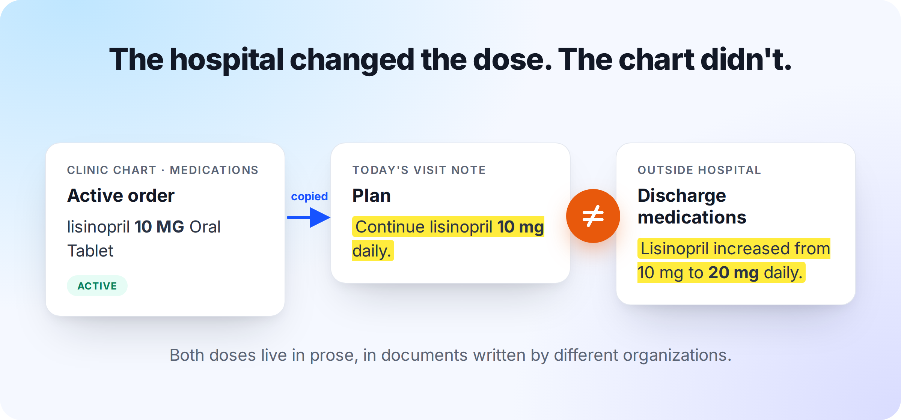
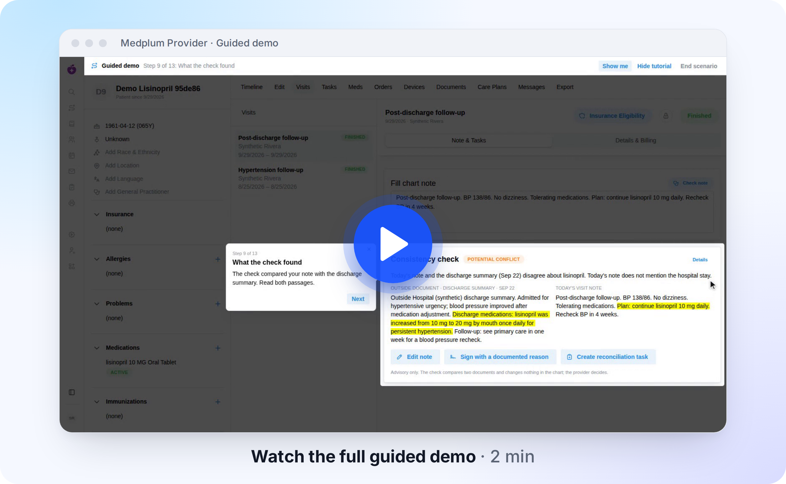
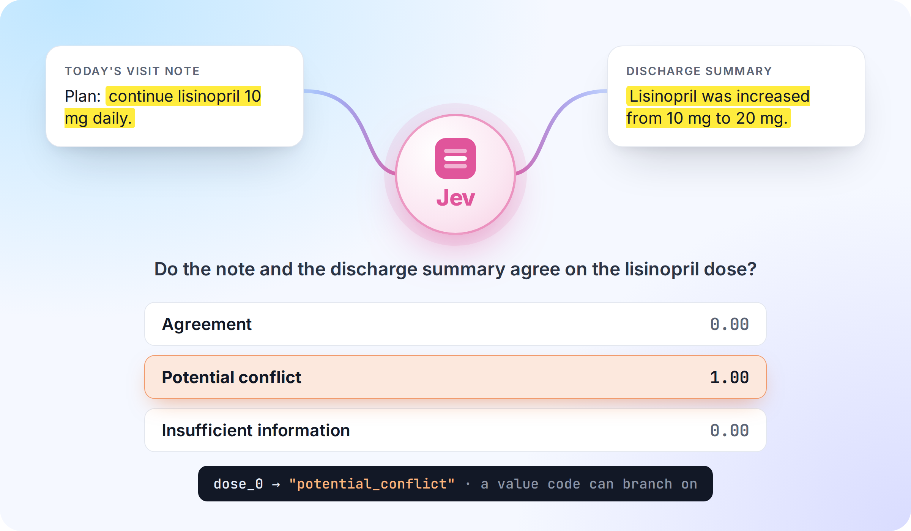
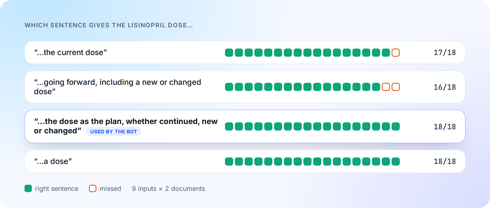

# A Jev-like AI for healthcare: checking visit notes against discharge summaries in Medplum

*Updated September 30, 2026. This demo uses synthetic data only.*

A patient comes back to primary care one week after a hospital stay for high blood pressure. The hospital raised their lisinopril from 10 mg to 20 mg once daily. The clinic’s chart still says 10 mg, and so does the last visit note. The provider is running late and copies the plan from the chart: “continue lisinopril 10 mg daily”. The visit’s clinical note now conflicts with the discharge summary on the dose, and nobody has noticed.



Every record is right on its own terms. The conflict sits between two documents written by two organizations, and no step in the visit puts them side by side. Found after signing, it turns into staff hours: a call to the patient, a check on which dose the pharmacy filled, an addendum to a signed note. Found before signing, it is a one-line edit.

We built an open-source demo that detects that conflict before signing, inside the Medplum Provider App: [vintasoftware/medplum-provider-jev](https://github.com/vintasoftware/medplum-provider-jev). When the provider finishes the visit, a Medplum Bot asks [Jev](https://typesafe.ai/), TypeSafe’s decision model, whether the note and the latest outside discharge summary agree on each active medication's dose. A review card shows the answer beside both passages. The provider can then correct the note, explain why the plan differs, or ask someone to reconcile the medication. 

## Following the discrepancy through a visit

In the demo, **Start scenario** creates a new synthetic patient with that history. A signed visit from 35 days ago lists lisinopril 10 mg, and the active order still has that dose. The discharge summary from a week ago raises it to 20 mg. Today's follow-up is ready to begin. The video below follows the provider through that visit in the real app, connected to a hosted Medplum project:

[](https://github.com/user-attachments/assets/ce413f25-983d-4384-9b5a-30054e6a4ebd)

The provider reads the discharge summary, writes the visit note and sets the visit to **Finished**. That saves the note and runs the check once. If the plan says "continue lisinopril 10 mg daily", the card reports a potential conflict and highlights the dose in each document.

From there, the provider can edit the plan to acknowledge the hospital's increase to 20 mg, then press **Check note** to review the revised text. They can also sign with a documented reason or create a reconciliation task.  Each choice is stored in the chart as FHIR records.

Below we have more examples of different Jev check results. A note that acknowledges the discharge dose produces agreement. "Continue lisinopril", with no dose, leaves too little information to compare. An unexplained increase to 40 mg produces another potential conflict: the model flags the difference for review because no reason was given.


## Why Jev? Turning the comparison into a typed answer

If both documents stored the dose in a separate field, the app could compare the values directly. Here, the dose is part of a sentence. The check has to distinguish an old prescription from a new plan and recognize when the provider has acknowledged a change.

Jev, TypeSafe's proprietary System One decision model, is able to read those sentences. We send it the documents as named JSON state, along with a question and the allowed answers. For a Choice question, Jev picks one of those answers and returns a probability for each option. Deterministic Medplum code can use the highest probability value directly (up to some limit), without having to interpret a written explanation.



For this check, the choices are `agreement`, `potential_conflict` and `insufficient_information`. We also tell the model what each answer means. Different doses count as a potential conflict when the later note does not acknowledge a change. A note that explicitly acknowledges the change can count as agreement. These definitions travel with the question in every request. Request to Jev is made via a deterministic Medplum Bot. Alternatively, open-weight models like Jebadiah could be used instead of Jev on [Modal.com](https://modal.com/) if you host them there:


That request asks three kinds of questions to the Decision Model (Jev / Jebadiah.). One Choice per medication supplies the dose label. A Yes/No question asks whether the note mentions the hospital stay, which affects the card's wording. Further Choice questions select from numbered sentences in each document, giving the card its highlights. The card also exposes the label probabilities so the provider can inspect the model's answer alongside the source text:


Here is an abbreviated request. The Bot, app and measurement script all read the same question wording from `provider/src/data/model-contract.json`:

```json
{
  "model": "jev-latest",
  "state": {
    "active_medications": ["lisinopril"],
    "outside_document": { "title": "Discharge summary", "date": "...", "author": "...", "text": "..." },
    "visit_note": { "title": "Today's visit note", "date": "...", "author": "...", "text": "..." }
  },
  "questions": {
    "dose_0": {
      "type": "choice",
      "instructions": "Do `outside_document.text` and `visit_note.text` agree about the current dose and frequency of lisinopril? `visit_note` was written after `outside_document`.",
      "criteria": {
        "agreement": "Both documents state a compatible dose and frequency for lisinopril, or the later document explicitly acknowledges the change described in the earlier one.",
        "potential_conflict": "The documents state different doses or frequencies for lisinopril as the current plan, and the later document does not acknowledge a change.",
        "insufficient_information": "At least one document does not state a dose or frequency for lisinopril, or does not mention it."
      }
    },
    "mentions_hospital_stay": { "type": "noul", "instructions": "..." },
    "sentence_visit_note_0": { "type": "choice", "instructions": "...", "criteria": { "s1": "...", "s2": "...", "none": "..." } }
  }
}
```

The Bot's TypeSafe key stays in a Medplum [project secret](https://www.medplum.com/docs/bots/bot-secrets). Learn more on how to use Jev by reading the [TypeSafe's documentation](https://docs.typesafe.ai/).

## Keeping the check with the provider's decision

Once the Bot returns a valid result, the app saves it as a `DetectedIssue` under the provider's access. It stores the labels, probabilities and sentence positions without copying chart text. Reloading the card reads that record rather than asking the model again. If the provider edits the note, the old check becomes stale until they press **Check note** and save a new result. After signing, both the signature and the check remain visible on the visit.


The provider's response is recorded with the result. Signing with a reason puts that reason on the signature's `Provenance` and adds a mitigation to the `DetectedIssue`. Creating a reconciliation task also records a mitigation, but deliberately leaves `Task.encounter` unset. Otherwise Sign & Lock would complete the task along with the visit, closing the request before anyone had reconciled the medication.

## How good is Jev? What the tests tell us

As of September 24, 2026, model `jev-1.13.0` matched the author's expected label on eight of the nine test inputs we generated and selected the expected sentence for all 18 highlights:


The remaining case exposed a disagreement between the authored reference and the question's criteria. It contained two dated lists with different doses and no explanation of the change. We had labeled that `insufficient_information`; the Bot's criteria define different current doses without acknowledgment as `potential_conflict`. Jev returned the latter with a probability of 1.00, following the criteria it received.

That result makes the definition of "conflict" part of the work still to evaluate. These nine synthetic inputs show how the model responds to our questions; they do not establish clinical accuracy. A clinical evaluation needs clinician-reviewed labels and must treat false agreements, which miss a dose error, differently from false conflicts, which cost the provider a review. Therefore, the displayed scores are a distribution over the available answers, not a measure of clinical correctness.

The highlights showed how much a small wording change can matter. Our first question asked for the sentence stating the *current* dose. For "increase lisinopril to 40 mg daily", Jev consistently chose `none`, with probabilities from 0.83 to 0.89 over five identical calls. The wording appears to have excluded a proposed change from what counted as current. We tried four versions on the same nine inputs:



The Bot now asks for the dose "as the plan, whether continued, new or changed". That wording selected all 18 expected sentences and is intended to favor the plan over a sentence mentioning an old dose.  

## Evaluating an open model

To explore running an open-weights model in our own [Modal](https://modal.com/) account, we deployed top-performing Jev-like open models on a private Modal GPU behind the same `/v1/systemone` request, so we can keep the same Medplum demo code. We took candidates with downloadable weights from the September 28 [Decision Index](https://huggingface.co/spaces/multimodalart/jev-decision-index) and ran the Bot's own requests for the five authored dose cases and the four scenario notes:

| Model | Decision Index | NLI4CT | Calibration error | Labels matching the reference | Highlights |
| --- | ---: | ---: | ---: | ---: | ---: |
| **Jebadiah 27B** | 54.67 | 0.832 | **0.014** | **8 of 9** | 18 of 18 |
| AutoJev-27B | 56.40 | **0.848** | 0.018 | 7 of 9 | 18 of 18 |
| Decider-35B-A3B NVFP4 | 47.11 | 0.785 | 0.023 | 7 of 9 | 18 of 18 |
| Jebadiah 9B v2 | not listed | | | 6 of 9 | 17 of 18 |
| Hosted Jev, for comparison | reference | 0.841 | | 8 of 9 | 18 of 18 |

The self-hosted labels include one answer rule. Jebadiah 27B, AutoJev and Decider each labeled the note with no dose `agreement` while their own highlight question found no dose sentence, so the Bot reports that case as insufficient information. Hosted Jev gets it right without the rule, which changes none of its answers.

The top performing one was Jebadiah 27B. It matched hosted Jev's count, and its calibration error is the lowest among the top entries, which matters because the card shows the probabilities. AutoJev-27B ranks higher on the index and on clinical-trial statements (NLI4CT), but on our cases it mislabeled both dated dose changes, one of them at 0.99. The index's top entry, Surogate Rune, is gated and has a calibration error of 0.12. Jebadiah's remaining miss is a dated change with no explanation, which it flagged as a conflict (0.94) where the reference expects insufficient information.

Jebadiah fine-tunes Qwen3.8-27B and reads each question's option logits in one forward pass, with a temperature fitted per question type. Its 56 GB of BF16 weights fit one A100 80 GB, about $3.16 per warm hour at list prices, scaling to zero between uses. Warm checks take 0.5–0.7 s; a cold start, including a kernel warm-up, usually takes three to four minutes, and once took 18 when the weights loaded slowly. It runs behind its authors' own server, pinned to a reviewed commit. More details at [Model card](https://huggingface.co/frontier-infra/jebadiah-27b), [server code](https://github.com/getainode/jebadiah), and our [SELF-HOSTING.md](SELF-HOSTING.md) documentation.


Nine authored cases cannot tell these models apart with confidence, and the benchmark index does not answer which one is best for this check either. ContractNLI measures legal document entailment; NLI4CT measures clinical-trial statements. Neither measures medication reconciliation, and the entries use different hardware. Our cases point to dated dose changes as a weak spot, which is another reason to keep both passages visible to the provider. The [index data](https://huggingface.co/spaces/multimodalart/jev-decision-index/blob/main/data/index.json) and [methodology](https://huggingface.co/spaces/multimodalart/jev-decision-index/blob/main/data/methodology.json) provide more context for those open models.

[DoccyHealth's Solomon](https://huggingface.co/DoccyHealth/Solomon) deserves a closer comparison because it was built for document-grounded healthcare questions. It uses trained answer heads and an adapter, with reusable document states and optional evidence pointers. Adopting it would require its own runtime and state-cache hosting. Its published validation covers 802 questions over 54 real documents, with AI-generated labels that were not human-verified, so it too needs a task-specific evaluation with clinicians.

A separate group of models explores decision-oriented inference with existing weights, without training a new checkpoint. [Simple Jev](https://github.com/featherless-ai/simple-jev) takes this approach.

## What would have to change for real patient data?

The current project contains only synthetic records. Moving to patient documents would require a separate access-controlled project, BAA coverage for every service that sees the text, and tested retention, deletion and incident handling. We have no evidence TypeSafe signs BAAs for healthcare comapnies using Jev.

Those requirements influenced the self-hosted deployment. Modal documents Enterprise BAAs and HIPAA support, with Volumes v2 covered but Volumes v1, user code, memory snapshots and most images excluded. Modal Servers proxy payloads without storing them, whereas Functions can keep inputs and outputs for up to seven days. Our demo endpoint therefore uses a Server with snapshots off and weights on a v2 Volume to simulate a HIPAA-compatible configuration. Learn more about [Modal security](https://modal.com/docs/guide/security).

## Taking the demo further

The immediate next step for Jebadiah is a larger evaluation on the same workflow as hosted Jev, with clinician-reviewed labels. The first runs already show where to look: missing doses and dated changes. [SELF-HOSTING.md](SELF-HOSTING.md#5-run-the-guided-demo-on-it) shows how to switch the demo to it.

The workflow could also support a different check: whether a signed note and its addenda support the diagnoses submitted on a claim. Before **Submit Claim** in Details & Billing, a Bot could ask one Choice per diagnosis the provider added: `supported`, `not_supported` or `insufficient_documentation`. The provider would resolve each result with an addendum or by removing the diagnosis; the model would never propose or change a code. 

As with the dose check, the provider would see the relevant passages before completing the work, and their decision would stay in the chart with the check.

To try the working dose check, start with the [README](README.md). It takes a Medplum project with Bots enabled, a TypeSafe API key and four commands.